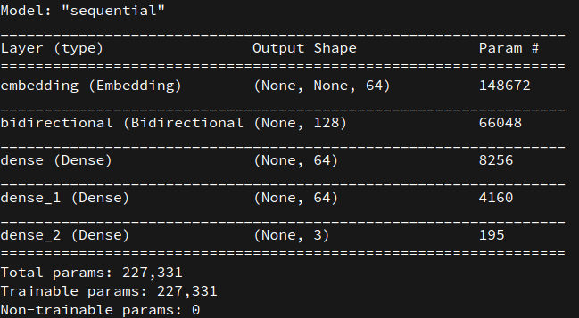
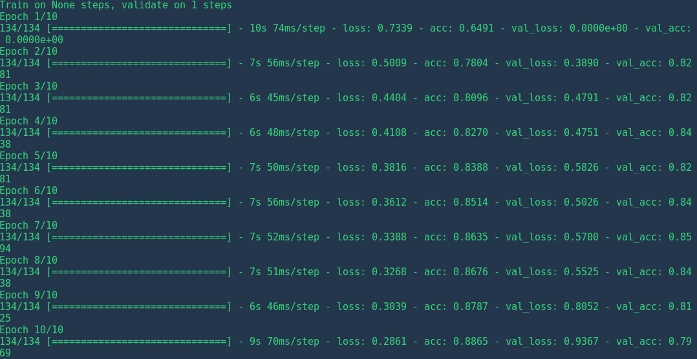
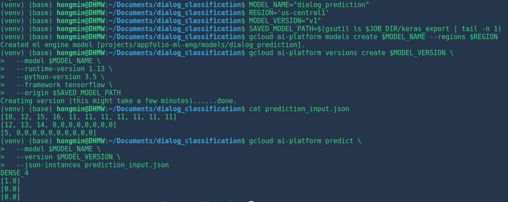

# Dialog Ｃlassification Challenge

## Abstract

This is text classification project that requires deployment of trained ML models for online requests.

The follow sections presents my path of tackling the challenge so far.

This informal report consists of the following sections:
- Problem Understanding
- System Design Procedures
    - Data preprocessing
    - Model design and training
- Future Improvements

With mostly research but not too much product deployment experiences, I had to learn the majority of the implementations and usages of Googld Cloud from scratch.
As much as I wanted to complete it (within 24 hours excluding eating and sleeping), this is still a great experience and many thoughts are still pending to be implemented.
Please feel free to contact me if you are interested in more details.

## Problem Understanding

This is a multi-class classfication problem. In particular, user responses during automatic customer support sessions are to be classified into 'HUMAN_FALLBACK', 'NOT_INTERESTED', and 'STILL_INTERESTED' categories.

- The files were initially in CSV format but saved as txt files for each category separately
- Cleaning is needed for the following items:
    - quotes `"`
    - pipe `|`
    - newlines `\n`
    - unicode for emoticons)

The goal is to use this dataset, train a ML model, deploy it on a cloud-based platform and enable online prediction requests.

## System design procedure

The following sections describes the itemized points. Please refer to the code comments for details

### Data Preprocessing

For this typical NLP problem, the first step is to deal with cleaning the data.

- Each text file is read as a whole and splitted into samples by this line of code:
`samples = fin.read().split(label)`. In this way, multi-line instances get to be preserved, compared to `split('\n')` and `\t` are automatically removed.

- Pipe `|` can be interpreted in two ways, as a sentence separator or instance separator
    - The former is equivalent to a period `.` (used in this project)
    - The latter means using each individual sentence as a separate instance with the same class label

- Each sentence is `split()` into tokens and the first and last tokens are removed as they are the labels and ids
- `spacy` is used for tokenization
- Only non-empty sentences with non-empty words are reserved

### Machine Learning Model Design
- We choose to use a neural network based model. In particular, a Bi-LSTM model for sentence classification.
- Implementation is based on `Tensorflow`, `Keras`
    - This directory is structures as follows:
        - trainer:
            - model.py: define Keras model
            - utils.py: data preprocessing functions
                - Read text files, split into samples, tokenize and remove some noises
                - Split into train, valid, test sets
                - Build vocab using the train set
            - task.py: main functions to call data preprocessing, building the model, run training and evaluation
        - setup.py: specifies dependencies when used to train on GCP
            - This would require uploading the dataset to GCP, which can be subject to privacy or cost issues, i.e. requiring not only computation powers but also storages for large projects
- Model details are as follows:
    - 
- `Google Cloud ML Engine` is chosen as the deployment platform
    - Following [Getting Started Keras](https://cloud.google.com/ai-platform/docs/getting-started-keras). We installed the Google Cloud SDK, set up the a Google Cloud project, created a Cloud Storage bucket, and trained the model locally using the following command:
        - `gcloud ai-platform local train --package-path trainer --module-name trainer.task --job-dir local-training-output`
    - Training
        - For the purpose of a demo only, the model is not tuned
        - 
    - Deploying on GCP and batch testing
        - 

## Obstacles Encountered and Future Improvements
Due to time constraints, this project is still incomplete with the following major steps undone:

- Online training
    - Package dependencies issues were solved by including the `setup.py` file
    - Location of dataset files on Google Could Storage is still unclear to me.
- Prediction
    - Currently only `Batch with gcloud tool` is partially tested
        - The input format still needs explorations
    - Online predictions may involve the follow items to be done:
        - Different json format to be processed
        - Customized text processing procedures, including preprocessing, vocabulary index lookup and feeding to the model
        - Output postprocessing, such as converting class labels into text strings before presenting to the user

## To Be Continued
Thank you very much for your time reading this!